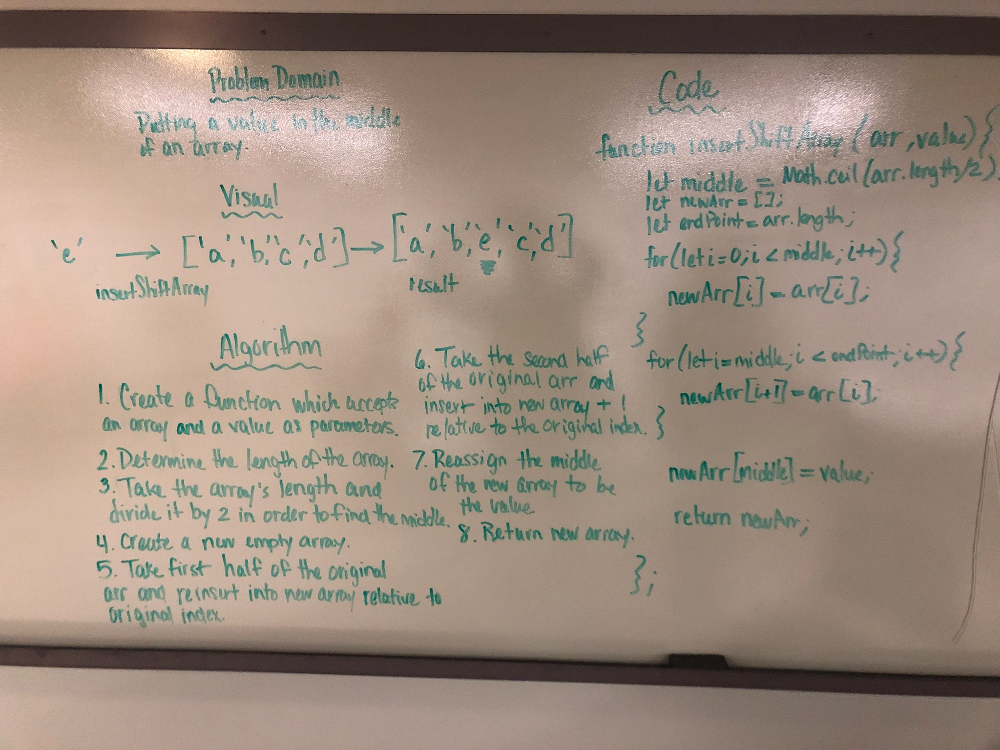
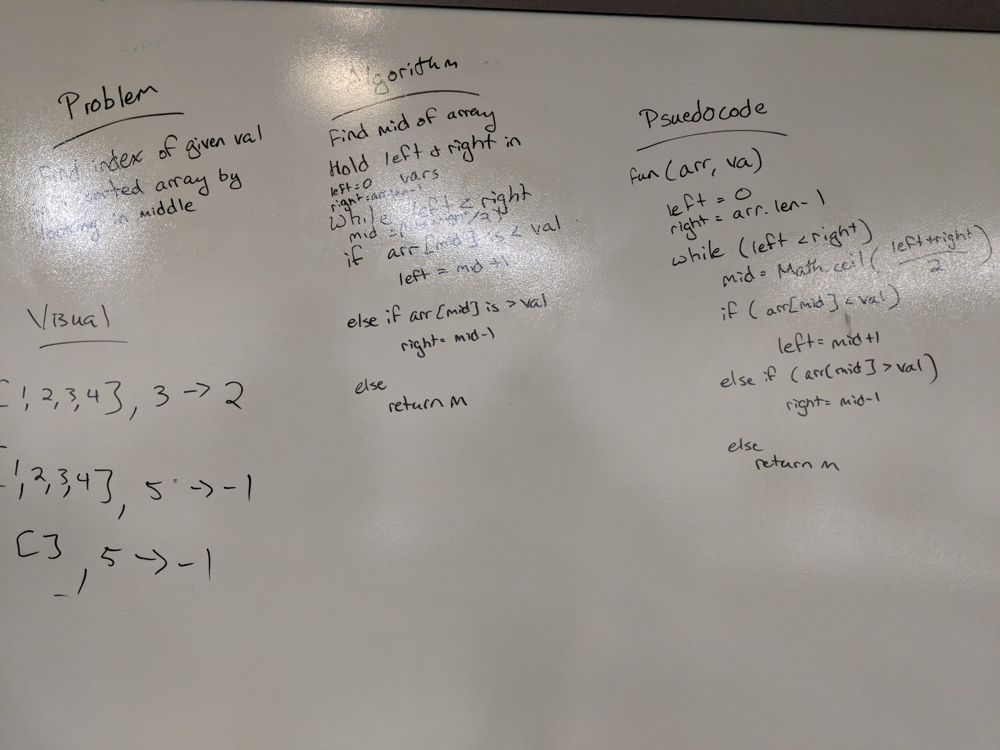
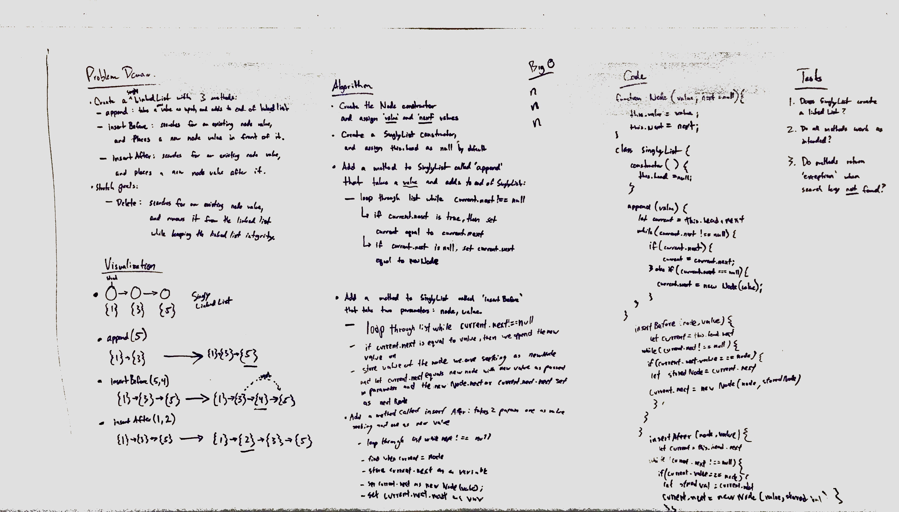
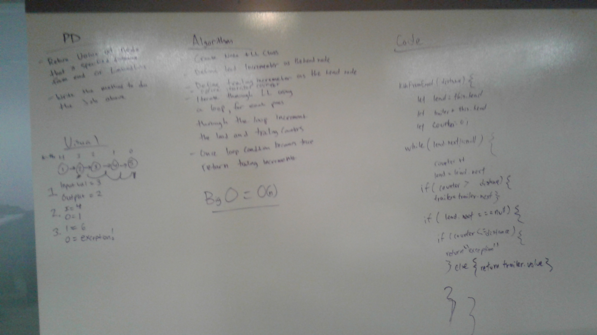

#Day 01

## Reverse an Array

Code Challenge 01

### Challenge

Takes in an array and reverse the order of that array

### Solution

#Day 02

# Insert Shift an Array

## Code Challenge 02

### Challenge

Takes in an array and a value and return a new array with the middle value inserted into the old array

### Solution

#Day 03

# Binary Search to find the object

## Code Challenge 03

### Challenge

Takes in and looks to either right or left for the object and goes from middle point everytime, returns the index

### Solution

#Day 04

# Linked Lists

## Code Challenge 04

### Challenge

Create a linked list and testing its functionalities

#Day 06

#Linked List Insertions

## Code Challenge 06

## Challenge

Created 3 methods, one that takes in a value and append the value on the very last of linked lists.

Another method that is called beforeInsertion (2 airty), looks for the specific value and add it before the value.

Another method that is called AfterInsertion (2 airty), looks for the specific value and add it after the value.

#Day 07

#linked List K-th from the end

## Code Challenge 07

## Challenge

Create a kth from end method that takes in 1 airty value (distance), to find the node that is the distance away from the last linked node.

Solved it by adding a follower tracker and starting it when it reach the threshold of the distance. It reads the value of that node and return exception when the distance is greater than the actual link length

Checked up on the structure and debugged some errors.
