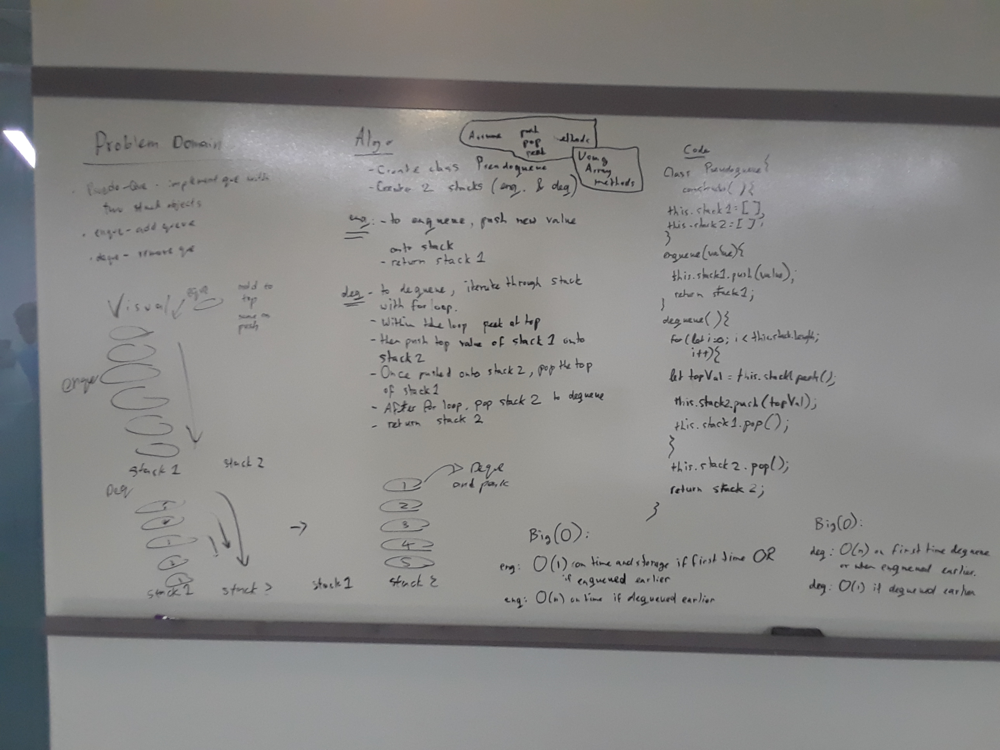
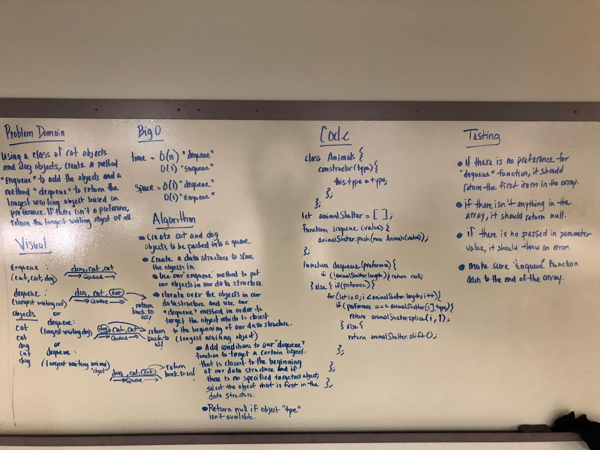
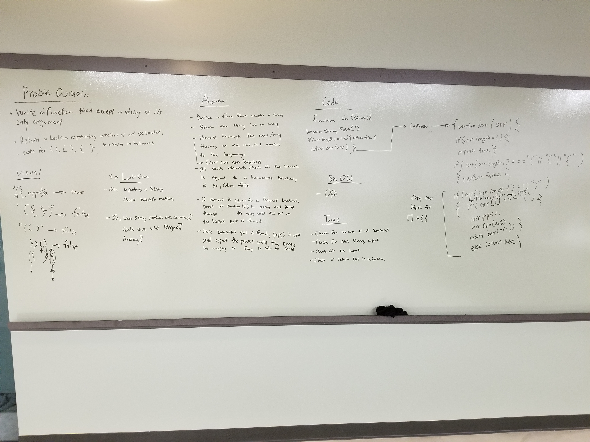
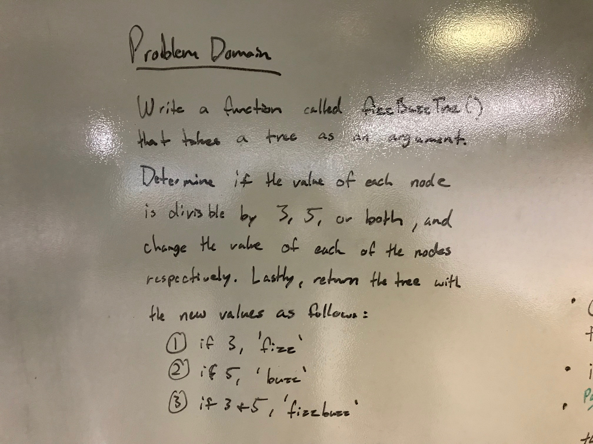
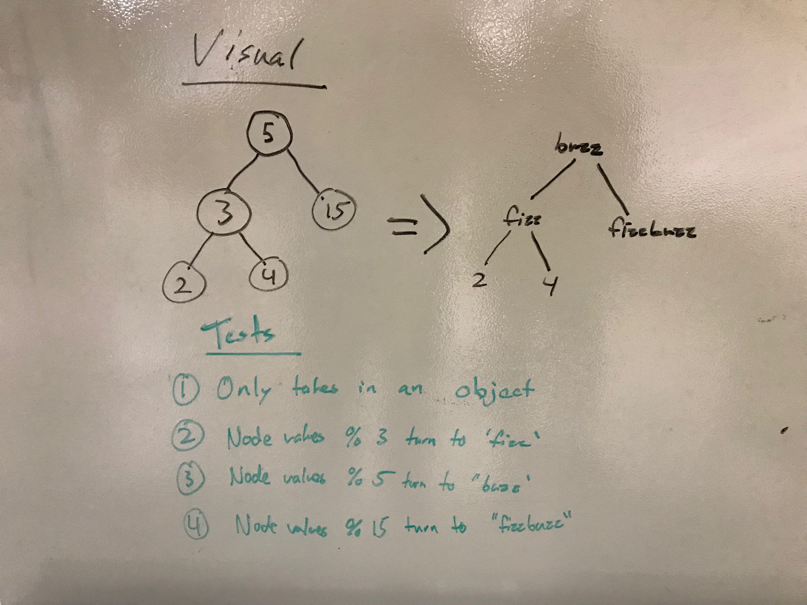
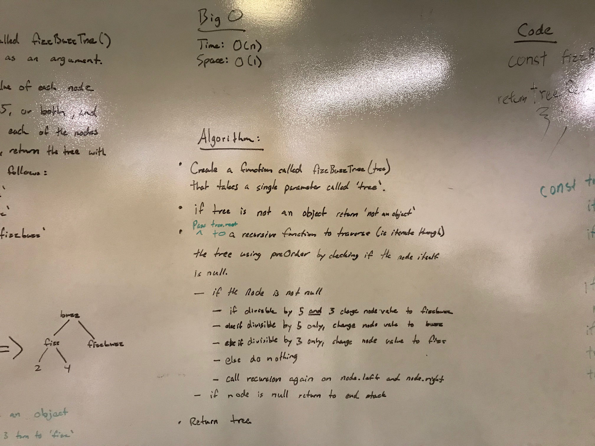
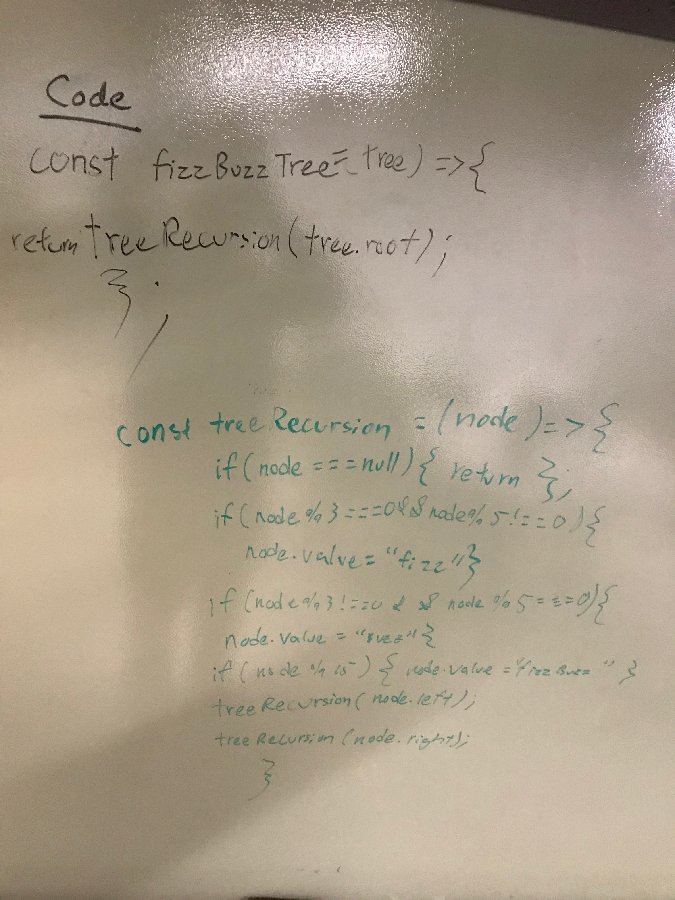
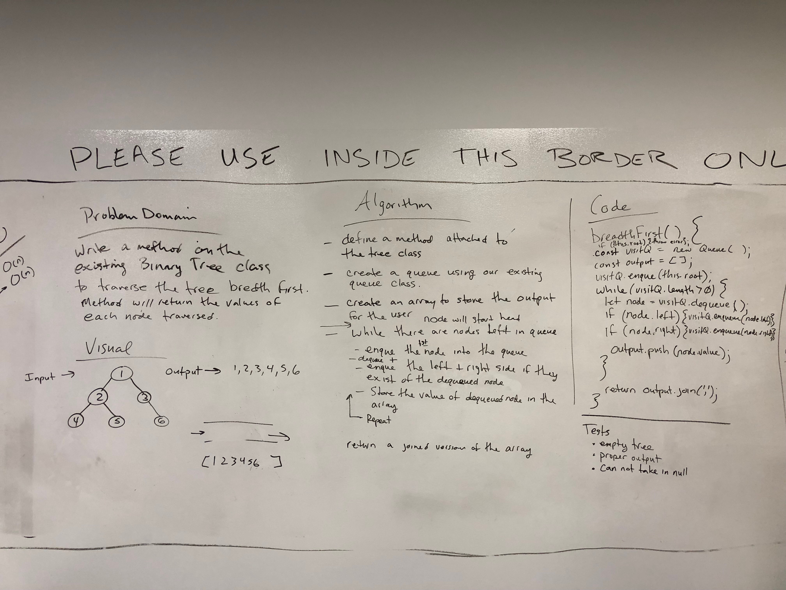
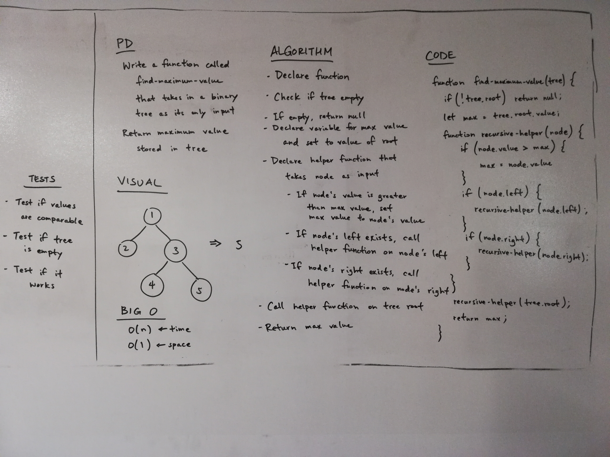

#Day 01

## Reverse an Array

Code Challenge 01

### Challenge

Takes in an array and reverse the order of that array

### Solution

#Day 02

# Insert Shift an Array

## Code Challenge 02

### Challenge

Takes in an array and a value and return a new array with the middle value inserted into the old array

### Solution

#Day 03

# Binary Search to find the object

## Code Challenge 03

### Challenge

Takes in and looks to either right or left for the object and goes from middle point everytime, returns the index

### Solution

#Day 04

# Linked Lists

## Code Challenge 04

### Challenge

Create a linked list and testing its functionalities

#Day 06

#Linked List Insertions

## Code Challenge 06

## Challenge

Created 3 methods, one that takes in a value and append the value on the very last of linked lists.

Another method that is called beforeInsertion (2 airty), looks for the specific value and add it before the value.

Another method that is called AfterInsertion (2 airty), looks for the specific value and add it after the value.

#Day 07

#linked List K-th from the end

## Code Challenge 07

## Challenge

Create a kth from end method that takes in 1 airty value (distance), to find the node that is the distance away from the last linked node.

Solved it by adding a follower tracker and starting it when it reach the threshold of the distance. It reads the value of that node and return exception when the distance is greater than the actual link length

Checked up on the structure and debugged some errors.

#Day 08

#LL merge

## Code Challenge 08

## Challenge

Create a merge method that takes 2 airty, 2 linked list as the parameter. It returns a brand new linked list with the values appended.

We accomplished this by keeping 2 current trackers and using while loop to itterate through each of them. We use an || to identify the actual longest length that needs to go forward and set an if so that the one that has the shorter length doesn't keep moving down a non-existent list. Then we append those values inside the while loop to return the linked list.

## Day 10

# Stacks and Queues

## Challenge

Make stack and queues and their methods

## Approach & Efficiency

took the array approach for stack: because it is O(1);
took the node approach for queue: because it is O(1) as well;

## API

Stack.push(value)= add item to the last of the stack
stack.pop()= remove item to the last of the stack
stack.peek()= look at the last of the stack;

queue.enque(value)= add item to the last of the list;
queue.dequeue = remove item from the first of the list;
queue.peek()= look at the first item

## Day 11

# PsuedoQue

##Challenge

Make queue with 2 stacks and immitate the effect of enqueue and dequeue

## Approach & Efficiency

Efficiency:
for Enqueue it is O(1) if it is in continuos enqueue but O(n) if it is dequeued prior
for DeQueue () it is O(n) if it has enqueued earlier else it is O(1);

Approach:
We stack the plate normally in a enque array then if we were to deque we push into the deque array and pop of the itmes we pushed to get a reversed approach to resemble First in first out

## Day 12

# Fifo Animal Shelter

## Challenge

Make queue that enqueue normally with object and type of species (cats/dogs) but for dequeue it reads for preferred and deque based on preferred.

## Efficiency:

For Enque it is O(1) for time and O(1) for space
For Deque it is O(n) for time and O(1) for space

## Approach:

We approach this que with arrays and we enqueue by using push method.

Then for deque we did a for loop to itterate and check on each animals for its type and we splice it out if the type matched.

# Bracket Validation

## Challenge

Validate matching brackets of {[]}

## Efficiency:

it is O(n) for time and O(1) for space

## Approach:

We approach this problem by removing all the alphabets, then we split it into array. We started some if function that makes it return false like odd number of elements. Then we created a recursive function that goes through pattern recognition and check with previous stack to compare and stop the recursion until all the items are on the other stack.

# Tree methods

## Challenge

added tree methods

## Efficiency:

Added tree methods:

add(): Time: O(n) space: O(1);
search(): Time: O(n) space: O(1);
preorder(): Time: O(n) space: O(1);
postorder(): Time: O(n) space: O(1);
inorder(): Time: O(n) space: O(1);

## Approach:

we approached trees with node and recursion, and accomplished tree implementation by navigating down the tree with recursion and checking for its state to do any of the other method listed above.

## Challenge:

To change each node that is divisible by tree into fizz, change each node that is divisible by 5 into buzz, and 15 to fizzbuzz.

## Efficiency:

Time: O(n) Space O(1)

## Approach:

Navigate down each tree node to see if they are divisble by those numbers and replace them, mainly used recursion.

## Challenge

To create a method that uses breadth traveling

## Efficiency:

Time O(n) Space O(1)

## Approach:

add each node to the que and ass their left or right if they exist and remove that node, using this method will traverse each array and get the desired approach

## Challenge:

To find the max value of the tree and compare the values.

## Efficiency:

Time: O(n) Space: O(1)

## Approach:

Navigate down each tree node to see if the value is greater than the max and replaces it and return the value of max.

## Challenge:

To build hashmap

## Approach:

Created hashing and added in methods to find, add, contains and GetHash

add- get the hash and add in key pair value
contains- check if the key exists
find- check if the key exist and returns the value
gethash- checks the key and returns the hash

## Challenge:

To check for duplicate words with a block of string

## Efficiency:

Time: O(n2) Space: O(n)

## Approach:

Split the string, first do contains method of hashmap and check for duplicate, then add it to the bucket if it doesn't match, if it does returns the string

## Challenge:

To check for share value between 2 trees

## Efficiency:

Time: O(n) Space: O(n)

## Approach:

Traverse through the array, use hashmap to check for uniqueness, if not unique add it to the return array

## Challenge:

Left join two hash map

##Efficienct:

Time O(n) Space O(n)

## Approach

Traverse through each bucket and append the value to new bucket, use the contains method to check for existing on second hash table, if it exists add it on. If not add null.

## Challenge:

Breadth first travel on graph

## Efficient:

Time O(n) Space O(n)

## Approach

Traverse through the breadth by utilizing que and sets. First use while look until que to get each node and its neighbors and then check with sets to make sure it is not already been traversed

## Challenge:

Get the edges of the array of vertices

## Efficient:

Time O(n^2) Space O(1)

## Approach

Check each array of vertices and then check the map to see if it exist, check each edge in that array. Then add the value to the returned array.
